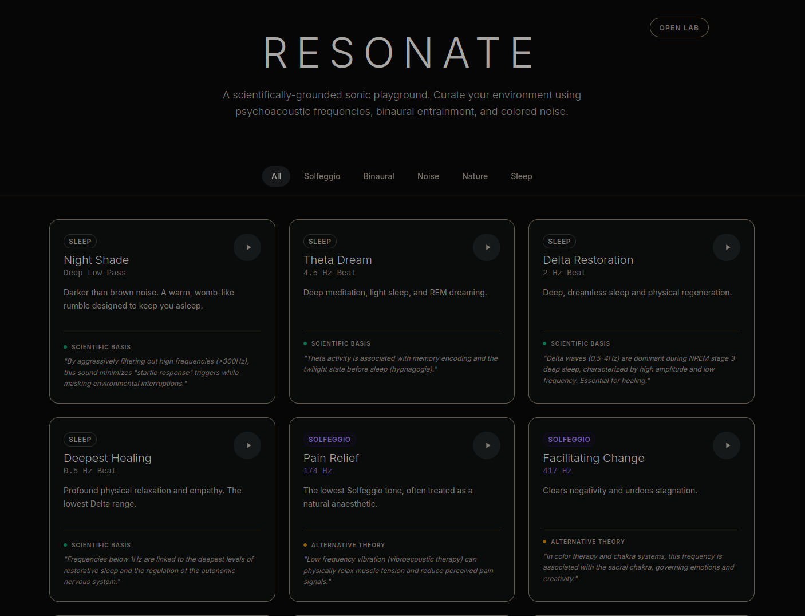

# Resonate - Sonic Therapy App

A scientific and pseudo-scientific soundscape generator built with React, TypeScript, Web Audio API, and Tailwind CSS. Features 27 curated sound presets including binaural beats, Solfeggio frequencies, colored noise, and sleep-optimized sounds, plus a full custom sound builder.

## 🎵 Live Demo

Try it out: [**https://brunwo.github.io/resonate/**](https://brunwo.github.io/resonate/)

### Screenshot


## 🚀 Running Locally

1.  **Install Dependencies**:
    ```bash
    pnpm install
    ```

2.  **Start Development Server**:
    ```bash
    pnpm run dev
    ```
    Open the URL shown in your terminal (usually http://localhost:5173).

## 📦 Building for Production

To create a static build (HTML/CSS/JS) for deployment:

```bash
pnpm run build
```
The output will be in the `dist/` folder.

## 🌐 Deploying to GitHub Pages

You can automate deployment using GitHub Actions.

1.  Commit this code to a GitHub repository.
2.  Ensure the `.github/workflows/deploy.yml` file exists (see below).
3.  Go to your repository **Settings** > **Pages**.
4.  Under "Build and deployment", select **Source: GitHub Actions**.
5.  Push your changes. GitHub will automatically build and publish the site.

## ✨ Features

- 🎛️ **Custom Sound Builder**: Create unique sonic combinations with adjustable frequencies, waveforms, binaural beats, and noise layering
- ⏰ **Sleep Timer**: Built-in timer with presets (15, 30, 60 minutes) that automatically stops all sounds
- 🎵 **27 Curated Presets**: Scientifically grounded frequencies across 5 categories:
  - **Sleep Sounds**: Deep relaxation and restorative sleep frequencies
  - **Solfeggio Frequencies**: Ancient healing tones (174Hz - 963Hz)
  - **Binaural Beats**: Brainwave entrainment (0.5Hz - 40Hz)
  - **Colored Noise**: White, pink, brown, green, violet, and filtered variants
  - **Isochronic Tones**: Frequency-based focus and meditation aids
- 🔊 **Real-time Audio Engine**: No external files required, infinite combinations possible
- 📱 **Progressive Web App**: Install on mobile devices for offline use
- 🎚️ **Individual Volume Controls**: Fine-tune each sound layer separately
- 🌓 **Responsive Design**: Optimized for desktop and mobile experiences

## � Tech Stack & Optimizations

-   **React + TypeScript**: Modern UI framework with hooks and type safety for robust development
-   **Vite**: Fast bundler with native ESM support and optimized production builds
-   **Tailwind CSS v4**: Latest utility-first CSS framework for efficient styling
-   **Web Audio API**: Real-time audio synthesis without external files
-   **PWA Features**: Service Worker caching, offline support, and install prompts for mobile app experience
-   **Inter Font**: Self-hosted font files for optimal loading performance and privacy

### Performance Optimizations

- ⚡ **Bundle size**: ~167KB total (CSS: ~30KB, JS: ~166KB split into 2 chunks)
- 🚀 **Code splitting**: Lazy loading for non-critical components
- 🎯 **CSS purging**: Only used Tailwind classes included

## �📄 License & Acknowledgments

This project is open source and uses several excellent open-source libraries:

- **[React](https://reactjs.org/)** - MIT License
- **[Vite](https://vitejs.dev/)** - MIT License
- **[Tailwind CSS](https://tailwindcss.com/)** - MIT License
- **[Workbox](https://developers.google.com/web/tools/workbox/)** - Apache License 2.0
- **[vite-plugin-pwa](https://github.com/vite-pwa-org/vite-plugin-pwa)** - MIT License

## 🙏 Thanks

Special thanks to the open-source community for creating such amazing tools that make modern web development possible!
